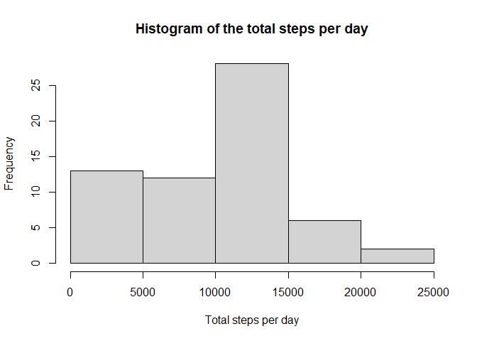

## Loading and preprocessing the data


```r
# load libraries
suppressMessages(library(dplyr))
suppressMessages(library(lattice))
# set the option to show the code in the final HTML
knitr::opts_chunk$set(echo = TRUE)
# load the data
activity <- read.csv("C:/Users/Kleber/Downloads/repdata_data_activity/activity.csv")
```


## What is mean total number of steps taken per day?


```r
# calculate the number of steps per day
activity_2 <- activity %>%   group_by(date) %>% summarise(steps = sum(steps, na.rm = T))
# plot histogram
hist(activity_2$steps, xlab = "Total steps per day", main = "Histogram of the total steps per day")
```

<!-- -->

```r
# calculate the mean of steps per day
mean_steps <- mean(activity_2$steps, na.rm = T)
# calculate the median of steps per day
median_steps <- median(activity_2$steps, na.rm = T)
```

The mean of the steps per day is **9354.23** and the median is 
**10395**.

## What is the average daily activity pattern?


```r
# calculate the average of the steps per 5-minute interval
activity_3<- activity %>%   group_by(interval) %>% summarise(steps = mean(steps, na.rm = T))
# plot the line chart
plot(x = activity_3$interval, y = activity_3$steps, type = "l", ylab = "Average of the steps", 
     xlab = "5-minute interval of the days", main = "Average of the steps per 5-minute interval")
```

<!-- -->

```r
# locate the maximum steps in an interval
max_activity <- activity_3[activity_3$steps==max(activity_3$steps),]
```

The maximum number of steps in an interval, on average across all days in the dataset, occurs on the interval 
**835**, when in average **206.17** steps were taken.


## Imputing missing values


```r
# calculate the number of rows with NA value in the column "steps"
number_NA <- nrow(activity[is.na(activity$steps),])
```

The number of rows with missing values (NA) is **2304**.


```r
# rename the steps column of the average dataset
colnames(activity_3) <- c("interval","avg_steps")
# merge the average of the steps per interval and the main dataset and create a new dataset
activity_noNA <- merge(activity, activity_3, by = "interval", all.x = T)
# fill the NA values with the average of the steps per interval
activity_noNA$steps <- ifelse(is.na(activity_noNA$steps), activity_noNA$avg_steps, activity_noNA$steps)
# remove the column with the average of the steps
activity_noNA$avg_steps <- NULL
# calculate the total number of steps per day
activity_noNA_2 <- activity_noNA %>% group_by(date) %>% summarise(steps = sum(steps))
# plot histogram with filled NA in dataset
hist(activity_noNA_2$steps, xlab = "Total steps per day",
     main = "Histogram of the total steps per day (with filled missing values)")
```

<!-- -->

```r
# calculate the mean of steps per day
mean_steps_2 <- mean(activity_noNA_2$steps)
# calculate the median of steps per day
median_steps_2 <- median(activity_noNA_2$steps)
```

The mean of the steps per day, after filling the missing values with the mean of the interval is 
**10766.19** and the median is **10766.19**. The impact of 
imputing missing data is the increasing of the mean and the median of the steps per day. Also, the mean and median are
identical now.

## Are there differences in activity patterns between weekdays and weekends?


```r
# change the date column to Date format
activity_noNA$date <- as.Date(activity_noNA$date, "%Y-%m-%d")
# create the new column with the weekday name
activity_noNA$week_col <- as.factor(weekdays(activity_noNA$date))
# create a column to mark the weekday and weekend
activity_noNA$name_days <- ifelse(activity_noNA$week_col%in%c("domingo","sábado"), "weekend", "weekday")
# change the column to factor
activity_noNA$name_days <- as.factor(activity_noNA$name_days)
# order by date
activity_noNA <- activity_noNA[order(activity_noNA$date, activity_noNA$week_col),]
# create a plot
xyplot(steps ~ interval | name_days, activity_noNA, layout = c(1,2), type = "l", ylab = "Number of steps",
       xlab = "Interval", main = "Number of steps per day (with filled missing values)")
```

<!-- -->
